# #1_脳表面・底面の構造
## 脳の被膜
### 2018年


```
1. Aの名称を答えよ。
2. Bの名称を答えよ。
3. 髄膜Cの名称を答えよ。
4. 髄膜Dの名称を答えよ。
5. 髄膜Eの名称を答えよ。
```
<div style="page-break-before:always"></div>

## 大脳半球外側面
### 2024年 


```
1. 次のうち、弁蓋部として最も正しいものはどれか?
    a. A
    b. B
    c. C
    d. D
    e. A-D のいずれでもない。
2.  次のうち、三角部として最も正しいものはどれか?
    a. A
    b. B
    c. C
    d. D
    e. A-D のいずれでもない。
3.  次のうち、眼窩部として最も正しいものはどれか?
    a. A
    b. B
    c. C
    d. D
    e. A-D のいずれでもない。
4.  優位半球とした場合、次のうち、感覚性言語中枢として最も正しいものはどれか?
    a. A
    b. B
    c. C
    d. D
    e. A-D のいずれでもない。
```
<div style="page-break-before:always"></div>

### 2018年


```
1.  脳回Aで示される部位の名称を答えよ。
2.  脳溝Bの名称を答えよ。
3.  脳回Cの名称を答えよ。
4.  脳回Dで示される部位の名称を答えよ。
5.  脳回Eと機能的に関連の深い感覚を答えよ。
```
<div style="page-break-before:always"></div>

## 大脳矢状断面
### 2021年


```
1. 次のうち、中心溝として最も正しいものはどれか?
    a. A
    b. B
    c. C
    d. D
    e. E
2. 次のうち、頭頂後頭溝として最も正しいものはどれか?
    a. A
    b. B
    c. C
    d. D
    e. E
3. 次のうち、Iの説明として最も正しいものかどれか?
    1. 左右の大脳半球をつなぐ神経線維束である。
    2. 海馬采に接続する神経線維束である。
    3. パーペツ回路を構成する神経線維束である。
    4. 上丘に接続する神経線維束である。
    5. 海馬体を構成する神経線維束である。
    a  1,2   b. 1,5   c. 2,3   d. 3,4   e. 4,5
4. 次のうち、IIの名称として最も正しいものはどれか?
    a. 第一裂
    b. 水平裂
    c. 山頂
    d. 片葉
    e. 小節葉
```
<div style="page-break-before:always"></div>

### 2019年


```
1. 次のうち、中心溝として最も正しいものはどれか?
    a. A
    b. B
    c. C
    d. D
    e. E
2. 次のうち、頭頂後頭溝として最も正しいものはどれか?
    a. A
    b. B
    c. C
    d. D
    e. E
3. 次のうち、Iの名称として最も正しいものかどれか?
    a. モンロー孔
    b. 卵円孔
    c. 正円孔
    d. ルシュカ孔
    e. マジャンディ孔
4. 次のうち、IIの名称として最も正しいものはどれか?
    a. 頭頂後頭溝
    b. 後頭前切痕
    c. ゲナリ線条
    d. 鳥距溝
    e. 帯状溝
```
<div style="page-break-before:always"></div>

## 脳底部の血管
### 2023年


```
1. 次のうち、Aの名称として最も正しいものはどれか?
    a. 前大脳動脈
    b. 前交通動脈
    c. 前下小脳動脈
    d. 後下小脳動脈
    e. 後大脳動脈
2. 次のうち、Bの名称として最も正しいものはどれか?
    a. 前大脳動脈
    b. 前交通動脈
    c. 前下小脳動脈
    d. 後下小脳動脈
    e. 後大脳動脈
3. 次のうち、Dの名称として最も正しいものはどれか?
    a. 前大脳動脈
    b. 前交通動脈
    c. 前下小脳動脈
    d. 後下小脳動脈
    e. 後大脳動脈
4. 次のうち、BとCに挟まれた部位に認められる脳神経として最も正しいものはどれか?
    a. 視神経
    b. 動眼神経
    c. 滑車神経
    d. 外転神経
    e. 顔面神経
```
<div style="page-break-before:always"></div>

### 2019年


```
1.  次のうち、血管Aの名称として最も正しいものはどれか?
    a. 前交通動脈
    b. 前大脳動脈
    c. 前脈絡叢動脈
    d. 眼動脈
    e. レンズ核線条体動脈
2.  次のうち、血管Bの名称として最も正しいものはどれか?
    a. 前交通動脈
    b. 前大脳動脈
    c. 前脈絡叢動脈
    d. 眼動脈
    e. レンズ核線条体動脈
3.  次のうち、血管Cの名称として最も正しいものはどれか?
    a. 後交通動脈
    b. 後大脳動脈
    c. 上小脳動脈
    d. 脳底動脈
    e. 前脈絡叢動脈
4.  次のうち、血管Dの名称として最も正しいものはどれか?
    a. 後交通動脈
    b. 後大脳動脈
    c. 上小脳動脈
    d. 脳底動脈
    e. 前脈絡叢動脈
```
<div style="page-break-before:always"></div>

```
5.  次のうち、脳神経Ⅰの名称として最も正しいものはどれか?
    a. 視神経
    b. 動眼神経
    c. 滑車神経
    d. 外転神経
    e. 顔面神経
6.  次のうち、脳神経IIの名称として最も正しいものはどれか?
    a. 視神経
    b. 動眼神経
    c. 滑車神経
    d. 外転神経
    e. 顔面神経
```

### 2017年

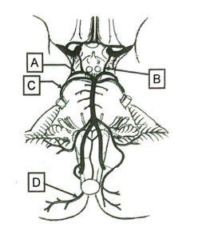
```
1. Aの血管名を答えよ。
2. Bの血管名を答えよ。
3. AとCの間に認められる脳神経の名称を答えよ。
4. Cの血管名を答えよ。
5. Dの血管名を答えよ。
```
<div style="page-break-before:always"></div>

## 脳の血管造影
### 2024年 


```
1. 血管Aの名称として最も正しいものはどれか?
    a. 前交通動脈
    b. 前大脳動脈
    c. 中大脳動脈
    d. 内頸動脈
    e. 脳底動脈
2. 血管Bの名称として最も正しいものはどれか?
    a. 前交通動脈
    b. 前大脳動脈
    c. 中大脳動脈
    d. 内頸動脈
    e. 脳底動脈
3. 血管Cの名称として最も正しいものはどれか?
    a. 前交通動脈
    b. 前大脳動脈
    c. 中大脳動脈
    d. 内頸動脈
    e. 脳底動脈
4. 血管Dの名称として最も正しいものはどれか?
    a. 前交通動脈
    b. 前大脳動脈
    c. 中大脳動脈
    d. 内頸動脈
    e. 脳底動脈
```
<div style="page-break-before:always"></div>

### 2021年


```
1. 次のうち、Aの名称として最も正しいものはどれか?
    a. 後大脳動脈
    b. 椎骨動脈
    c. 前大脳動脈
    d. 内頚動脈
    e. 中大脳動脈
2.  次のうち、Dの名称として最も正しいものはどれか?
    a. 後大脳動脈
    b. 椎骨動脈
    c. 前大脳動脈
    d. 内頚動脈
    e. 中大脳動脈
3.  次のうち、Eの名称として最も正しいものはどれか?
    a. 後大脳動脈
    b. 椎骨動脈
    c. 前大脳動脈
    d. 内頚動脈
    e. 中大脳動脈
4.  次のうち、最も脳動脈瘤ができやすい部位はどれか?
    a. A
    b. B
    c. C
    d. D
    e. E
```
<div style="page-break-before:always"></div>

### 2018年


```
1.  脳血管Aの名称を答えよ。
2.  脳血管Bの名称を答えよ。
3.  脳血管Cの名称を答えよ。
4.  脳血管Dの名称を答えよ。
5.  脳血管Eの名称を答えよ。
```
<div style="page-break-before:always"></div>

# #2_脳底面・内側面の構造
## 脳底部の神経
### 2021年


```
1.  次のうち、Aの説明として最も正しいものかどれか?
    1. 視覚反射に関連する。
    2. 聴覚の中継核である。
    3. その障害によりパーキンソン病を発症する。
    4. パーペツ回路を構成する。
    5. 視床下部に属する。
    a  1,2   b. 1,5   c. 2,3   d. 3,4   e. 4,5
2.  次のうち、Bの名称として最も正しいものはどれか?
    a. 動眼神経
    b. 滑車神経
    c. 三叉神経
    d. 顏面神経
    e. 内耳神経
3.  次のうち、Cの名称として最も正しいものはどれか?
    a. 動眼神経
    b. 滑車神経
    c. 三叉神経
    d. 顏面神経
    e. 内耳神経
4.  次のうち、Dと関連の深いものとして最も正しい組み合わせはどれか?
    1. 皮質脊髄路
    2. 登上線維
    3. 運動学習
    4. 苔状線維
    5. 皮質核路
    a  1,2   b. 1,5   c. 2,3   d. 3,4   e. 4,5
```
<div style="page-break-before:always"></div>

### 2018年


```
1.  脳神経Aの名称を答えよ。
2.  脳神経Bが支配する筋の名称を答えよ。
3.  脳神経Cが支配する筋の名称を答えよ。
4.  DとEの間に認められる脳神経の名称を答えよ。
5.  Eの名称を答えよ。
```
<div style="page-break-before:always"></div>

## 中脳矢状断面
### 2023年


```
1. 次のうち、Aの名称として最も正しいものはどれか?
    a. 室間孔
    b. 正中口
    c. 外側口
    d. 室頂
    e. 中脳水道
2. 次のうち、Bの名称として最も正しいものはどれか?
    a. 脳梁
    b. 前交連
    c. 透明中隔
    d. 脳弓
    e. 帯状回
3. 次のうち、Cの名称として最も正しいものはどれか??
    a. 外側膝状体
    b. 視交叉
    c. 乳頭体
    d. 上丘
    e. 松果体
4. 次のうち、Dの名称として最も正しいものはどれか?
    a. 室間孔
    b. 正中口
    c. 外側口
    d. 室頂
    e. 中脳水道
```
<div style="page-break-before:always"></div>

## 脳室の構造
### 2024年


```
1. 次のうち、中脳水道として最も正しいものはどれか?  
    a. A
    b. B
    c. C
    d. D
    e. E
2. 次のうち、モンロー(Monro)孔として最も正しいものはどれか?
    a. A
    b. B
    c. C
    d. D
    e. E
3. 次のうち、ルシュカ(Luschka)孔として最も正しいものはどれか?
    a. A
    b. B
    c. C
    d. D
    e. E
4. 次のうち、1日当たりの脳脊髄液産生量として最も正しいものはどれか?
    a. 50ml
    b. 100ml
    c. 200ml
    d. 500ml
    e. 1000ml
```
<div style="page-break-before:always"></div>

### 2021年

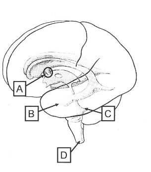
```
1. 次のうち、Aの名称として最も正しいものはどれか?
    a. 中心管
    b. 正円孔
    c. 中脳水道
    d. モンロー孔
    e. ルシュカ孔
2. 次のうち、Bの名称として最も正しいものはどれか?
    a. 側脳室前角
    b. 側腦室後角
    c. 側脳室下角
    d. 第三脳室後角
    e. 第三脳室下角
3. 次のうち、Cの名称として最も正しいものはどれか??
    a. 閂
    b. モンロー孔
    c. マジャンディ孔
    d. ルシュカ孔
    e. 室頂
4. 次のうち、Dの名称として最も正しいものはどれか?
    a. 中心管
    b. 正円孔
    c. 中脳水道
    d. モンロー孔
    e. ルシュカ孔
```
<div style="page-break-before:always"></div>

### 2018年


```
1. Aの名称を答えよ。
2. Bにより左右が連結する脳内部位の名称を答えよ。
3. Cの名称を答えよ。
4. Dが示す脳室の名称を答えよ。
5. Eの名称を答えよ。
```
## 脳脊髄液の流れ
<div style="page-break-before:always"></div>

# #3_脳幹と小脳の観察
## 脳幹背側面
### 2019年


```
1. 次のうち、脳神経Aに関する記述として最も正しいものの組み合わせはどれか?
    1. 副交感神経線維を含む。
    2. 上斜筋を支配する。
    3. 眼球運動に関連する。
    4. 中脳から出る唯一の脳神経である。
    5. 標的近くで神経節を形成する。
    a  1,2   b. 1,5   c. 2,3   d. 3,4   e. 4,5
2. 次のうち、Bの名称として最も正しいものはどれか?
    a. 舌下神経三角
    b. 迷走神経三角
    c. 閂
    d. 顏面神経丘
    e. 錐体
3. 次のうち、Cの名称として最も正しいものはどれか??
    a. 舌下神経三角
    b. 迷走神経三角
    c. 閂門
    d. 顔面神経丘
    e. 錐体
4. 次のうち、Dを通る神経に関する説明として最も正しいものの組み合わせはどれか?
    1. 温痛覚を伝える。
    2. 粗大な触圧覚を伝える。
    3. 意識にのぼる深部感覚を伝える。
    4. 下肢からの情報を伝える。
    5. 平衡覚を伝える。
    a  1,2   b. 1,5   c. 2,3   d. 3,4   e. 4,5
```
<div style="page-break-before:always"></div>

### 2017年


```
1.  Aが示す脳神経の名称を答えよ。
2.  Aが支配する筋の名称を答えよ。
3.  Bの名称を答えよ。
4.  Cの名称を答えよ。
5.  Dの名称を答えよ。
```

## 脳神経核の配置
<div style="page-break-before:always"></div>

## 脳幹の切断面
### 2023年

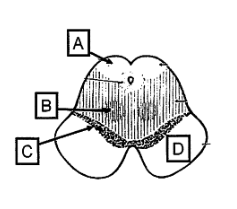
```
1.  Aの名称として最も正しい組み合わせはどれか?
    1. 視蓋
    2. 赤核
    3. 黒質
    4. 被蓋
    5. 上丘   
    a  1,2   b. 1,5   c. 2,3   d. 3,4   e. 4,5
2.  Bの説明として最も正しい組み合わせはどれか?
    1. メラニン色素を多く含む。
    2. ドーパミン産生細胞である。
    3. 鉄を多く含む。
    4. 運動学習を含む運動の調節に関係する。
    5. 錐体路を中継する。
    a  1,2   b. 1,5   c. 2,3   d. 3,4   e. 4,5
3.  Cの説明として最も正しい組み合わせはどれか?
    1. メラニン色素を多く含む。
    2. ドーパミン産生細胞である。
    3. 鉄を多く含む。
    4. 運動学習を含む運動の調節に関係する。
    5. 錐体路を中継する。
    a  1,2   b. 1,5   c. 2,3   d. 3,4   e. 4,5
4.  次のうち、Dの名称として最も正しいものはどれか?
    a. 橋縦束
    b. 大脳脚
    c. 上小脳脚
    d. 中小脳脚
    e. 錐体
```
## 小脳表面の観察
## 小脳核の観察
<div style="page-break-before:always"></div>

# #4_大脳の内部構造
## 大脳半球(間脳を含む)の水平断
### 2024年
  

```
1. パーペツ回路に含まれる部位として、最も正しいものはどれか?
    a. A
    b. B
    c. C
    d. D
    e. E
2. 錐体路が通る部位として、最も正しいものはどれか?
    a. A
    b. B
    c. C
    d. D
    e. E
3.  大脳皮質と内包を繋ぐ部位として、最も正しいものはどれか?
    a. A
    b. B
    c. C
    d. D
    e. E
4.  脳梁を含む部位として、最も正しいものはどれか?
    a. A
    b. B
    c. C
    d. D
    e. E
```
<div style="page-break-before:always"></div>

## 大脳半球(間脳を含む)の前額断
### 2023年


```
1. 次のうち、パーペツ回路(パペッツ) 回路を構成するものとして最も正しいものの組み合わせはどれか?
    1. A
    2. B
    3. C
    4. D
    5. E   
    a  1,2   b. 1,5   c. 2,3   d. 3,4   e. 4,5
2.  次のうち、黒質からの神経が入力する部位として最も正しいものの組み合わせはどれか?
    1. A
    2. B
    3. C
    4. D
    5. E   
    a  1,2   b. 1,5   c. 2,3   d. 3,4   e. 4,5
```
<div style="page-break-before:always"></div>

```
3.  次のうち、Iの名称として最も正しいものはどれか?
    a. 脳弓
    b. 脳梁
    c. 帯状回
    d. 放線冠
    e. 内包
4.  上図は下図をどの面で切断したものか?
    a. 1
    b. 2
    c. 3
    d. 4
    e. 5
```

### 2021年


```
1.  次のうち、Aの名称として最も正しいものはどれか?
    a. 尾状核
    b. 被殼
    c. 淡蒼球
    d. 視床
    e. 前障
2.  次のうち、Bの名称として最も正しいものはどれか?
    a. 放線冠
    b. 弓状線維
    c. 上縦束
    d. 内包
    e. 大脳脚
```
<div style="page-break-before:always"></div>

```
3.  次のうち、Cの名称として最も正しいものはどれか?
    a. 視床下核
    b. 縫線
    c. 青斑
    d. 赤核
    e. 黑質
4.  次のうち、Dの名称として最も正しいものはどれか?
    a. 側脳室
    b. 第三脳室
    c. くも膜下腔
    d. 外側溝
    e. 脳溝
```

### 2017年

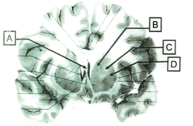
```
1.  Aの名称を答えよ。
2.  Bの名称を答えよ。
3.  Cの名称を答えよ。
4.  Dの名称を答えよ。
5.  B及びDに入力する神経の起始核がある中脳の部位を答えよ。
```
## 代表的疾患(内頚動脈閉塞、ラクナ梗塞、くも膜下出血)のCT,MRT画像
<div style="page-break-before:always"></div>

# #5_神経線維と基底核の剖出
## 神経線維
### 2024年

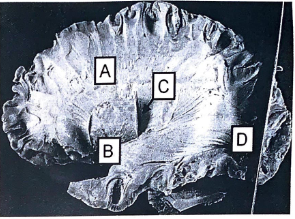
```
1.  次のうち、Aの名称として最も正しいものはどれか?
    a. 内包
    b. 放線冠
    c. 脳梁
    d. 上縦束
    e. 帯状束
2.  次のうち、Bの名称として最も正しいものはどれか?
    a. 弓状線維
    b. 内包
    c. 上縦束
    d. 鈎状束
    e. 視放線
3.  次のうち、C(矢印の先)の名称として最も正しいものはどれか?
    a. レンズ核
    b. 視床
    c. 島
    d. 尾状核
    e. 黒質
4.  次のうち、Dの名称として最も正しいものはどれか?
    a. 弓状線維
    b. 内包
    c. 上縦束
    d. 鈎状束
    e. 視放線
```
<div style="page-break-before:always"></div>

### 2018年

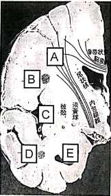
```
1.  内包に繋がる神経線維Aの名称を答えよ。
2.  神経線維Bの名称を答えよ。
3.  大脳皮質Cの名称を答えよ。
4.  神経線維Dの名称を答えよ。
5.  脳室Eの名称 (部位まで)を答えよ。
```

### 2017年


```
1. Aの名称を答えよ。
2. Bの名称を答えよ。
3. Cの名称を答えよ。
4. Dの名称を答えよ。
5.  Dを通る神経線維が向かう視床の部位を答えよ。
```
<div style="page-break-before:always"></div>

## 大脳基底核
### 2023年


```
1.  次のうち、Aの名称として最も正しいものはどれか?
    a. 松果体
    b. 乳頭体
    c. 海馬体
    d. 扁桃体
    e. 線条体
2.  次のうち、Bの名称として最も正しいものはどれか?
    a. 被殼
    b. 尾状核
    c. 淡蒼球
    d. 視床
    e. 脳弓
3.  次のうち、Cの名称として最も正しいものはどれか?
    a. 帯状回
    b. 脳弓
    c. 乳頭体
    d. 海馬指
    e. 扁桃体
4.  次のうち、Dの説明として最も正しいものはどれか?
    a. 脳脊髄液を吸収する。
    b. 側脳室のみに認められる構造である。
    c. くも膜顆粒と呼ばれる。
    d. 脈絡叢と呼ばれる。
    e. 神経線維の集まりである。
```
<div style="page-break-before:always"></div>


### 2019年

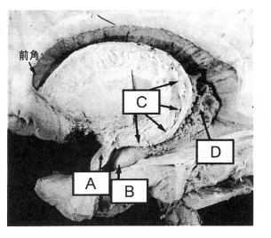
```
1. 次のうち、Aの名称として最も正しいものはどれか?
    a. 扁桃体
    b. 乳頭体
    c. 淡蒼球
    d. 海馬傍回
    e. 海馬指
2.  次のうち、Bの名称として最も正しいものはどれか?
    a. 扁桃体
    b. 乳頭体
    c. 淡蒼球
    d. 海馬傍回
    e. 海馬指
3.  次のうち、Cの名称として最も正しいものはどれか?
    a. 脳弓
    b. 海馬采
    c. 被殼
    d. 尾状核
    e. 透明中隔
4.  次のうち、Dの機能として最も正しいものはどれか?
    a. 脳脊髄液を産生する。
    b. 下縦束を形成する。
    c. 左右の大脳半球をつなぐ。
    d. 側脳室と第3脳室をつなぐ。
    e. 脳脊髄液を吸収し、硬膜静脈洞に還流させる。
```
<div style="page-break-before:always"></div>

### 2018年

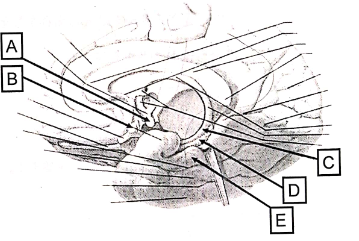
```
1.  Aの名称を答えよ。
2.  神経線維束Bの名称を答えよ。
3.  海馬体を構成するCの名称を答えよ。
4.  海馬体を構成するDの名称を答えよ。
5.  海馬体を構成するEの名称を答えよ。
```
<div style="page-break-before:always"></div>

### 2018年

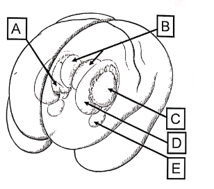
```
1.  Aの名称を答えよ。
2.  Bの名称を答えよ。
3.  Cの名称を答えよ。
4.  Dの名称を答えよ。
5.  Eの名称を答えよ。
```
### 2017年


```
1.  Aの名称を答えよ。
2.  Bの名称を答えよ。
3.  Cの名称を答えよ。
4.  Dの名称を答えよ。
5.  Dで産生されるものの名称を答えよ。
```

<div style="page-break-before:always"></div>

# 2024
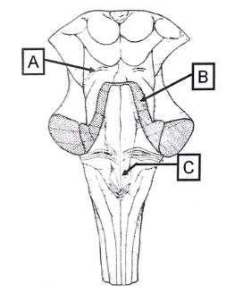
図において、A、B、Cの名称、及びそれぞれについて知るところを述べよ。
# 2023
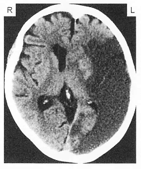
図(脳梗塞後のCT画像)について知るところを述べよ。

# 2021
脳脊髄液の流れについて知るところを述べよ。
<div style="page-break-before:always"></div>

# 2019

図(CT画像)を見て、1. 何が異常か？、さらに、2. その原因となる疾患について知るところを述べよ。