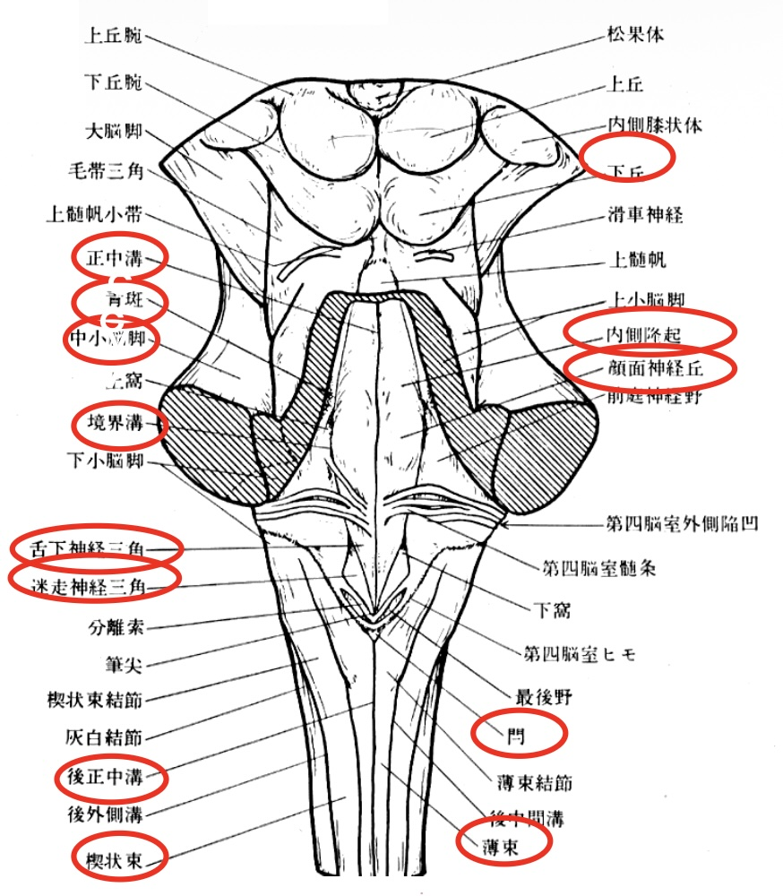

# #1_脳表面・底面の構造
## 脳の被膜
### 2018年

```
脳実習用講義プリントp1より
脳の髄膜は
硬膜、くも膜、軟膜の3層によって構成されている。
くも膜顆粒というカリフラワー状の突出物が存在する。
導出静脈と呼ばれる構造物の存在も忘れられない。
A: 硬膜の中にあり、硬膜静脈洞(1)
B: カリフラワー状の突出であり、くも膜顆粒(2)
C: 硬膜(3)
D: くも膜(4)
E: 軟膜(5)
```
<div style="page-break-before:always"></div>

## 大脳半球外側面
### 2024年 


<div style="page-break-before:always"></div>

```
脳実習用講義プリントp2、p3より
A: 眼窩部(3)
B: 三角部(2)
C: 弁蓋部(1)
D: 中心前回
という名称であることがわかる。
感覚性言語中枢は感覚系なので、中心溝の後ろに存在する。よってA~Dのいずれでもない。(4)
運動性言語中枢は下前頭回の弁蓋部と三角部で構成される。
```

### 2018年

```
2024年と同じ図から、
A: 弁蓋部(1)
B: 下前頭溝(2)
C: 中心前回(3)
D: 角回(4)
E: 上側頭回
という名称であることがわかる。また、Eの位置は聴覚に深く関連する。(5)
```

脳回E: 上側頭回 は感覚性言語野(ウェルニッケ中枢)
 

<div style="page-break-before:always"></div>

## 大脳矢状断面
### 2021年


```
脳実習用講義プリントp9より
A: 中心傍溝の前にあるので中心前溝
B: 中心傍溝の後ろにあるので中心溝(1)
C: 中心溝の後ろにあるので帯状溝の縁部
D: 不明
E: 頭頂葉と後頭葉を分けるので頭頂後頭溝(2)
という名称であることがわかる。
また、(3)について、

I: 脳弓である。
1. 左右の大脳半球をつなぐ神経線維束である。 : 脳梁もしくは交連線維
2. 海馬采に接続する神経線維束である。 : 脳弓のこと神経解剖#12プリントp4より
3. パーペツ回路を構成する神経線維束である。 : 脳弓、乳頭体視床路、帯上束が該当 実習#5プリントp4より
4. 上丘に接続する神経線維束である。: 不明。ギリ投射繊維? 
5. 海馬体を構成する神経線維束である: シェーファー側枝、苔状線維、貫通繊維など。神経解剖#12プリントp4より
実習#3プリントp7よりIIは第一裂(4)
```

### 2019年

```
脳実習用講義プリントp9より
A: 中心傍溝の前にあるのが中心前溝
B: 中心傍溝の後にあるのが中心溝(1)
C: 中心溝の後ろにあるので帯状溝の縁部
D: 不明
E: 頭頂後頭溝(2)
という名称であることがわかる。
また、Iは側脳室と第3脳室を繋いでおり、室間孔、別名モンロー孔という。(3)
マジャンディ孔は脳幹背側で観察可能な正中孔。ルシュカ孔はマジャンディ孔と同じ高さに観察可能な外側の孔。
II: 鳥距溝(4)
```
<div style="page-break-before:always"></div>

## 脳底部の血管
### 2023年

```
A: 前大脳動脈
B: 後大脳動脈
C: 上小脳動脈
D: 前下小脳動脈

後大脳動脈と上小脳動脈の間に挟まれているのは動眼神経である。
```
<div style="page-break-before:always"></div>

### 2019年

```
A: 前大脳動脈(1)
B: 前脈絡索動脈(2)
C: 後交通動脈(3)
D: 後大脳動脈(4)
I: 後大脳動脈と上小脳動脈に挟まれるのは動眼神経。(5)
II 上に三叉神経が見えるので、その一つ下の高さで最も内側から出てくる神経は外転神経であるということができる。(6)
```

血管B: d. 眼動脈


### 2017年


```
A: 後大脳動脈(1)
B: 後交通動脈(2)
C: 上小脳動脈(4)
D: 後下小脳動脈(5)
後大脳動脈と上小脳動脈に挟まれるのは動眼神経。(3)
```
<div style="page-break-before:always"></div>

## 脳の血管造影
### 2024年 


| 動脈       | 略称 | 動脈         | 略称  |
| :--------- | :--- | :----------- | :---- |
| 内頚動脈   | ICA  | 前交通動脈   | A-com |
| 脳底動脈   | BA   | 後交通動脈   | P-com |
| 前大脳動脈 | ACA  | 上小脳動脈   | SCA   |
| 中大脳動脈 | MCA  | 前下小脳動脈 | AICA  |
| 後大脳動脈 | PCA  | 後下小脳動脈 | PICA  |
```
プリントに載っている脳血管造影は左側画像のみなので、出題も左側だと考えて良い。また、脳血管像映像でプリントに載っているのは前後像または左側画像のみなので、そのどちらかが出ると考えて良い。
脳実習用講義プリントp5、及び神経解剖#18脳の血管プリントp1を参照。
正中線があるので、これは前後像。補足として挙げた図や血管の出ている方向などから
A: 前大脳動脈(1)
B: 中大脳動脈(2)
と同定。そのまま前大脳動脈との位置関係から
D: 内頚動脈(4)
とわかる。
内頚動脈、前大脳動脈、中大脳動脈を消去し、また脳底動脈は前大脳動脈や中大脳動脈とは後交通動脈でしかつながっておらず、造影されるとは考えづらいため、消去法でCは前交通動脈であると同定できる。(3)
```

### 2021年
```
A: 前大脳動脈(1)
B: ?
C: 前交通動脈
D: 中大脳動脈(2)
E: 内頚動脈(3)
脳動脈瘤が起こりやすいのは前交通動脈、後交通動脈によって形成されるウイリス動脈輪であり、すなわち答えはCである。(4)
```
<div style="page-break-before:always"></div>

### 2018年

```
この図は正中線がなく、左側から見た図であるとわかる。
A: 後大脳動脈
B: 後交通動脈
C: 上小脳動脈
D: 脳底動脈
E: 後下小脳動脈
```
<div style="page-break-before:always"></div>

# #2_脳底面・内側面の構造
## 脳底部の神経
### 2021年


```
脳実習用講義プリントp8より
A: 乳頭体
B: 三叉神経(2)
C: 顔面神経(3)
D: オリーブ
乳頭体はパーペツ回路を構成する視床下部の部位。よってe(1)
神経解剖#11小脳プリントp4より、
2. 登上繊維はオリーブが小脳皮質に出力する繊維。
3. 運動学習は赤核、オリーブ核、小脳皮質が連絡することで起きる連絡の一つである。
4. 苔状線維は橋核が小脳皮質に投射する繊維。
よってcとわかる。(4)
```
```
geminiより: 小脳の苔状線維と海馬の苔状線維の違いについて
小脳の苔状線維は、大脳皮質や脊髄、前庭神経核などから橋核を経て小脳皮質に投射する興奮性の神経線維です。
これらの線維は、顆粒細胞と呼ばれる小脳皮質のニューロンにシナプスを形成し、大脳からの運動情報などを小脳に伝達する重要な役割を担っています。

一方、海馬の苔状線維は、海馬の歯状回にある顆粒細胞の軸索が、海馬CA3野の錐体細胞に投射する線維です。
歯状回からCA3野への情報の伝達経路を形成し、記憶や学習に深く関わっています。

両者は「苔状線維（mossy fiber）」という同じ名称で呼ばれていますが、その起始（どこから始まるか）と投射先（どこへ向かうか）、そして役割が異なります。名称は、その樹状突起がまるで苔のようであるという、その形態的な特徴から名付けられたものです
```
<div style="page-break-before:always"></div>

### 2018年

```
A: 動眼神経 (1)
B: 滑車神経
C: 外転神経
D: オリーブ
E: 錐体 (5)
滑車神経が支配する筋肉は上斜筋である。(2)
外転神経が支配する筋肉は外直筋である。(3)
オリーブと錐体の間から舌下神経が出る。(4)
```
<div style="page-break-before:always"></div>

## 中脳矢状断面
### 2023年


```
脳実習#2プリントp1より
A: 室間孔(モンロー孔)(1)
B: 脳弓(2)
C: 松果体(3)
D. 室頂(4)
```
<div style="page-break-before:always"></div>

## 脳室の構造
### 2024年


```
脳実習用講義プリントp1より
A: 室間孔(モンロー孔)(2)
B: 脈絡叢
C: 第3脳室
D: 中脳水道(1)
E: ルシュカ孔(3)
脳実習用講義ダイジェストp6より
脳脊髄液は側脳室、第3脳室、第4脳室の脈絡叢で産生され、その量は500ml/dayである。(4)
```
<div style="page-break-before:always"></div>

### 2021年


```
前角、後角などがどこから持ってきているのか不明のため、ネット上から持ってきました。プリントにあったら教えて下さい。
(https://visual-anatomy-data.net/comment/sa/ze-anterior-horn-of-lateral-ventricle.html)
A: モンロー孔(室間孔)(1)
B: 側脳室下角(2)
C: マジャンディ孔(第4脳室正中口)(3)
D: 中心管(4)
```

<!-- 4 大脳の内部構造のp.3-4の断面図とその切断位置の図から想像するしかなさそう．側脳室前角(p.3 左上)，下角(p.4 右下)は書いてある -->

<div style="page-break-before:always"></div>

### 2018年


```
A: 室間孔(1)
B: 視床間橋(2)
C: 中脳水道(3)
D: 第4脳室(4)
E: 第4脳室外側口(ルシュカ孔)(5)
視床間橋の回答根拠は上図より。
```

<!-- Eは印刷が薄いが，image-56-1.pngを見ると中心管の上のハグしてる手みたいなやつを指していると思われる -->

## 脳脊髄液の流れ

```
脳脊髄液の流れ:
側脳室 -> (室間孔: Monro孔) -> 第3脳室 -> 中脳水道 -> 第4脳室
-> (正中口: Magendi孔，外側口: Luschka孔) -> くも膜下腔 -> くも膜顆粒 -> 硬膜静脈洞
```

<div style="page-break-before:always"></div>

# #3_脳幹と小脳の観察
## 脳幹背側面
### 2019年


```
実習#3プリントp2より
A: 滑車神経
B: 顔面神経丘(2)
C: 迷走神経三角(3)
D: 薄束
副交感神経繊維を含むのは動眼神経、顔面神経、舌咽神経、迷走神経。
上斜筋を支配するのは滑車神経。
眼球運動に関連するのは動眼神経、滑車神経、外転神経
そもそも中脳からは動眼神経と滑車神経の2つの脳神経が出る。(神経解剖#9_脳幹プリントp2)
標的近くで神経節を形成するものは、副交感神経の繊維をもつものであり、滑車神経はそれに当たらない。(ソースはgemini, プリントに書いてあったら教えて下さい。)
よって、答えは2,3のc。(1)
上肢からの精細触圧覚と意識性深部感覚は楔状束を通る。
下肢からの精細触圧覚と意識性深部感覚は薄束を通る。
よって3,4であるd。(4)
```
<div style="page-break-before:always"></div>

### 2017年

```
A: 滑車神経(1)
B: 上小脳脚(3)
C: 顔面神経丘(4)
D: 舌下神経三角(5)
滑車神経が支配するのは上斜筋である。(2)
```

## 脳神経核の配置
## 脳幹の切断面
### 2023年


```
A: 上丘、視蓋(1): a
B: 赤核
C: 黒質
D: 大脳脚(4)
上丘は視覚と関連し視蓋とも呼ばれる。
下丘は聴覚と関連する。
神経解剖#9_脳幹プリントp3より、
赤核は鉄を多く含み、運動の制御を行う。(2): d
黒質はドーパミンを産生して大脳基底核ルートに関連する。
また、メラニン色素を多く含むことによって黒く見える。(3): a
```
<div style="page-break-before:always"></div>

## 小脳表面の観察

## 小脳核の観察


# #4_大脳の内部構造
## 大脳半球(間脳を含む)の水平断
### 2024年


```
A: 内包の後脚
B: 内包の前脚
C: ?
D: 脳梁(4)
E: 脳弓
パーペツ回路に含まれるのは脳弓。(1)
錐体路が通るのは内包の前脚なのでB。(2)
大脳皮質と内包を繋ぐのはC?これは不明。(3)
```
<div style="page-break-before:always"></div>

## 大脳半球(間脳を含む)の前額断
### 2023年


```
A: 帯状束
B: 尾状核
C: 被殻
D: 淡蒼球
E: 海馬
パーペツ回路を構成するのは帯上束と海馬。よってb(1)
黒質から賛成されたドーパミンは尾状核、被殻をあわせた線条体に出力する。よってc(2)
Iは内包。(3)
この図には脳弓が確認できるため、1,2,3に絞れる。また、
橋へつながっている部分が確認できるため、2,3と考えることができる。
さらに橋の上の正中部分で空洞が確認できるため、2と同定できる。(4)
(この解説のやり方が正しいかどうかはわかりません。より良いやり方がある場合教えて下さい。)
```
<div style="page-break-before:always"></div>

### 2021年

```
A: 尾状核(1)
B: 内包(2)
C: 黒質(3)
D: 側脳室(4)
```

### 2017年


```
A: 脳弓(1)
B: 尾状核(2)
C: 内包(3)
D: 被殻(4)
被殻、尾状核は合わせて線条体と呼ばれ、黒質からの連絡を受ける。(5)
```
## 代表的疾患(内頚動脈閉塞、ラクナ梗塞、くも膜下出血)のCT,MRT画像
<div style="page-break-before:always"></div>

# #5_神経線維と基底核の剖出
## 神経線維
### 2024年


```
1.  次のうち、Aの名称として最も正しいものはどれか?
    a. 内包
    b. 放線冠
    c. 脳梁
    d. 上縦束
    e. 帯状束

2.  次のうち、Bの名称として最も正しいものはどれか?
    a. 弓状線維
    b. 内包
    c. 上縦束
    d. 鈎状束
    e. 視放線

3.  次のうち、C(矢印の先)の名称として最も正しいものはどれか?
    a. レンズ核
    b. 視床
    c. 島
    d. 尾状核
    e. 黒質

4.  次のうち、Dの名称として最も正しいものはどれか?
    a. 弓状線維
    b. 内包
    c. 上縦束
    d. 鈎状束
    e. 視放線
```

### 2018年


```
1.  内包に繋がる神経線維Aの名称を答えよ。
2.  神経線維Bの名称を答えよ。
2.  大脳皮質Cの名称を答えよ。
3.  神経線維Dの名称を答えよ。
4.  脳室Eの名称 (部位まで)を答えよ。
```
<div style="page-break-before:always"></div>

### 2017年


```
1. Aの名称を答えよ。
2. Bの名称を答えよ。
3. Cの名称を答えよ。
4. Dの名称を答えよ。
5.  Dを通る神経線維が向かう視床の部位を答えよ。
```
## 大脳基底核
### 2023年


```
1.  次のうち、Aの名称として最も正しいものはどれか?
    a. 松果体
    b. 乳頭体
    c. 海馬体
    d. 扁桃体
    e. 線条体

2.  次のうち、Bの名称として最も正しいものはどれか?
    a. 被殼
    b. 尾状核
    c. 淡蒼球
    d. 視床
    e. 脳弓

3.  次のうち、Cの名称として最も正しいものはどれか?
    a. 帯状回
    b. 脳弓
    c. 乳頭体
    d. 海馬指
    e. 扁桃体

4.  次のうち、Dの説明として最も正しいものはどれか?
    a. 脳脊髄液を吸収する。
    b. 側脳室のみに認められる構造である。
    c. くも膜顆粒と呼ばれる。
    d. 脈絡叢と呼ばれる。
    e. 神経線維の集まりである。
```
<div style="page-break-before:always"></div>


### 2019年


```
1. 次のうち、Aの名称として最も正しいものはどれか?
    a. 扁桃体
    b. 乳頭体
    c. 淡蒼球
    d. 海馬傍回
    e. 海馬指

2.  次のうち、Bの名称として最も正しいものはどれか?
    a. 扁桃体
    b. 乳頭体
    c. 淡蒼球
    d. 海馬傍回
    e. 海馬指

3.  次のうち、Cの名称として最も正しいものはどれか?
    a. 脳弓
    b. 海馬采
    c. 被殼
    d. 尾状核
    e. 透明中隔

4.  次のうち、Dの機能として最も正しいものはどれか?
    a. 脳脊髄液を産生する。
    b. 下縦束を形成する。
    c. 左右の大脳半球をつなぐ。
    d. 側脳室と第3脳室をつなぐ。
    e. 脳脊髄液を吸収し、硬膜静脈洞に還流させる。
```
### 2018年


```
1.  Aの名称を答えよ。
2.  神経線維束Bの名称を答えよ。
3.  海馬体を構成するCの名称を答えよ。
4.  海馬体を構成するDの名称を答えよ。
5.  海馬体を構成するEの名称を答えよ。
```
<div style="page-break-before:always"></div>

### 2018年


```
1.  Aの名称を答えよ。
2.  Bの名称を答えよ。
3.  Cの名称を答えよ。
4.  Dの名称を答えよ。
5.  Eの名称を答えよ。
```
### 2017年


```
1.  Aの名称を答えよ。
2.  Bの名称を答えよ。
3.  Cの名称を答えよ。
4.  Dの名称を答えよ。
5.  Dで産生されるものの名称を答えよ。
```

<div style="page-break-before:always"></div>

# 2024

図において、A、B、Cの名称、及びそれぞれについて知るところを述べよ。
# 2023

図(脳梗塞後のCT画像)について知るところを述べよ。

# 2021
脳脊髄液の流れについて知るところを述べよ。
# 2019

図(CT画像)を見て、1. 何が異常か？、さらに、2. その原因となる疾患について知るところを述べよ。